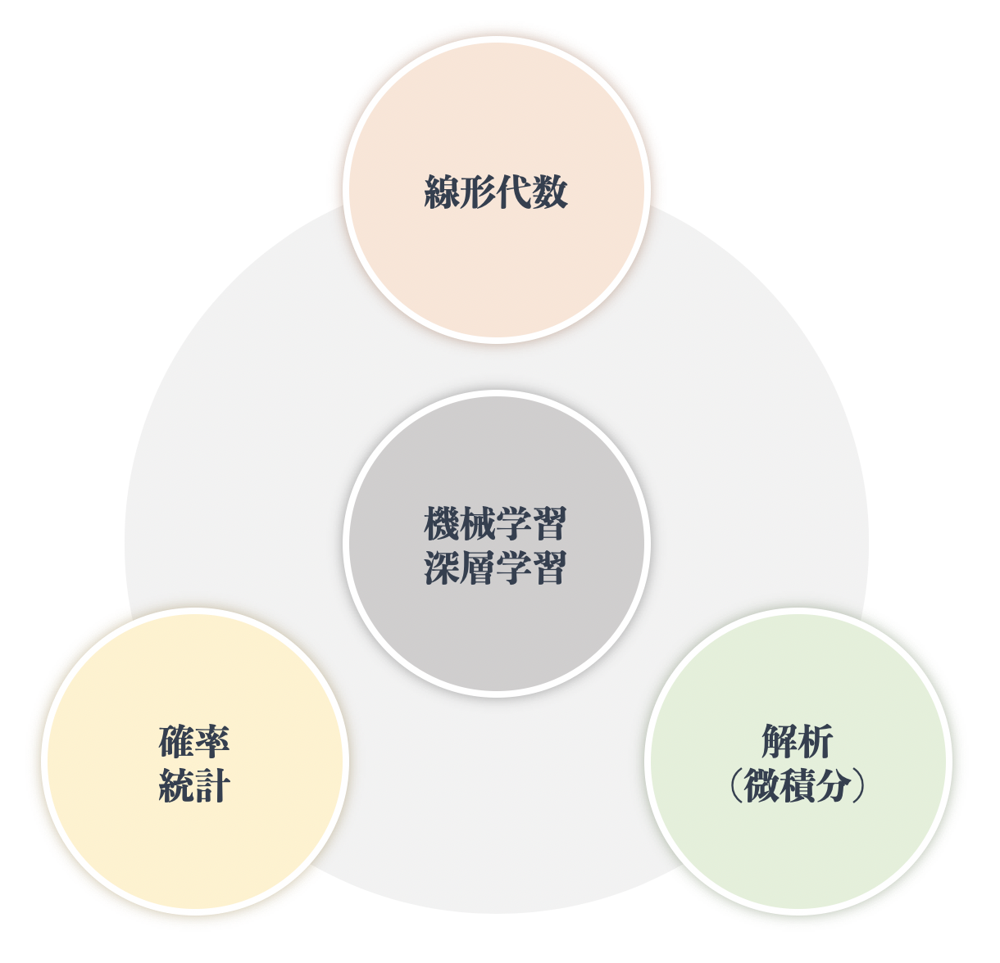

# 02 機械学習・深層学習の基本

* 機械学習深層理解への学習の最短路（概念編）

* 機械学習深層理解への学習の最短路（書籍編）

## 02-01 First, be a good man/woman.

## 02-02 英語

* 論文を読むとき、海外のエンジニアと研究者と議論するとき

* 英語で情報を収集するとき

* GitHubを使うとき

* Kaggleなど競技に参加するとき

* TensorFlow, Kerasなどのドキュメントを読むとき

* エラーメッセージを読むとき

* 調べる時のキーワードは英語の方は候補が多い

## 02-03 必要な数学知識（必須ではないが、あれば良い）

* 線形代数

* 確率・統計

* 解析（微積分）

## 02-04 Pythonの基礎

* 環境構築：[機械学習・深層学習のためのPython環境構築（PC版）](https://kokensha.xyz/ml/anaconda-install-to-pc-for-machine-learning-and-deep-learning/)

* ループ

* 配列操作

## 02-05 オブジェクト指向プログラミングの基礎

* オブジェクト

* インスタンス

* クラス

* 継承

* 多態性

## 02-06 重要ライブラリの基礎

* SciPy

* NumPy

行列の演算

形状変更

* Pandas

* matplotlib
