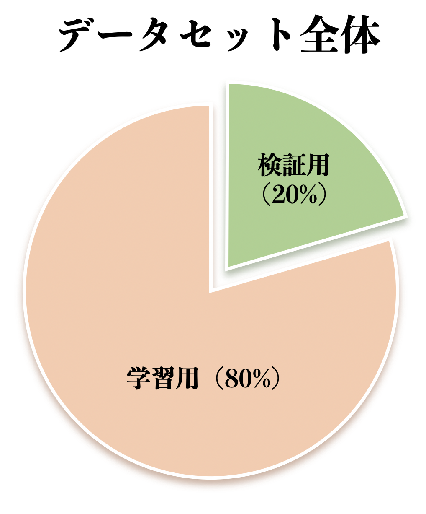
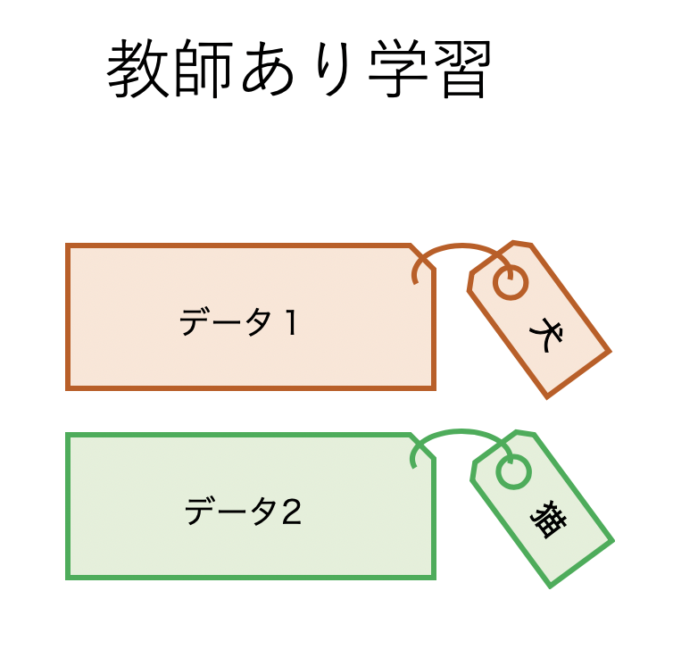
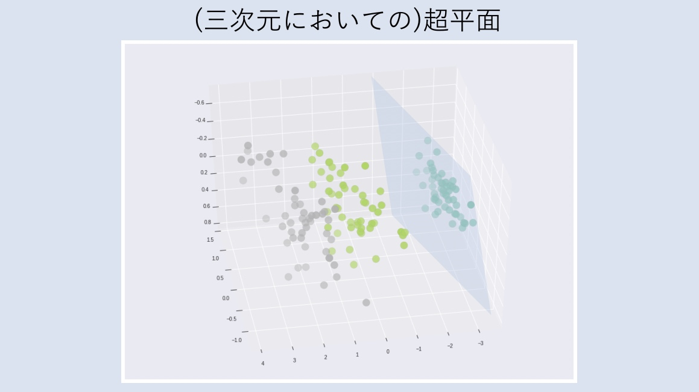
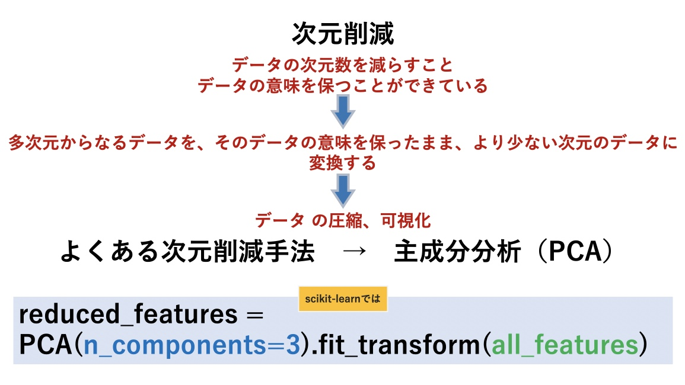

# 03 機械学習

## 学習データについて

## 学習の種類

### 教師あり学習(supervised learning)

フォルダの名称が「正解教師ラベル」になる場合もあります。

得意なタスク

#### 分類(classification)

* 決定木(decision tree)

* ランダムフォレスト(random forest)

* SVM(support vector machine) 

  - 超平面（hyper plane）
  

* k-平均法（k-means）

もっともよく知られているクラスタリングアルゴリズムの１つです。

* [ニューラルネットワーク](https://github.com/Kokensha/machine_learning_deep_learning_lessons/blob/master/04_artificial_neural_network.md)

#### 回帰(regression)

* ロジスティック回帰

* k-近傍法（k-nearest neighbor algorithm, k-NN）

* ランダムフォレスト回帰(random forest)

* SVM回帰

* [ニューラルネットワーク](https://github.com/Kokensha/machine_learning_deep_learning_lessons/blob/master/04_artificial_neural_network.md)

### 教師なし学習(unsupervised learning)

タスク

#### クラスタリング(clustering)

* k-平均法（k-means）

もっともよく知られているクラスタリングアルゴリズムの１つです。

#### 相関ルール学習

#### 異常検知

#### 次元削減

* PCA

  - 

### 強化学習

## scikit-learn

* [scikit-learn url](https://scikit-learn.org/stable/)

* scikit-learnの実戦
