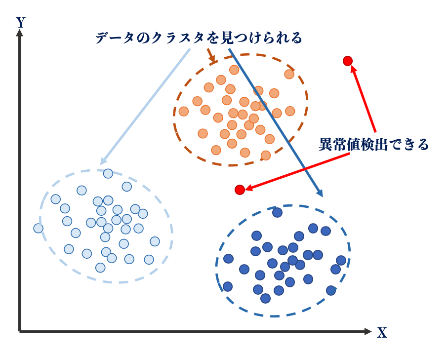

# 03 機械学習（machine learning）　

機械学習とは！

機械学習は人間が明示的にプログラミングせずに、コンピュタがデータから学習できるためのプログラミングの手法です。

例えばよくあるのは、分類です。

入力の画像がりんごなのか、ミカンなのかを認識してもらいたいタスクがあるとします。

この「分類器(classifier)」を作ることが機械学習の目的です。

機械学習では、この分類器を作るのは人間ではなく、コンピュータです。

## 学習の種類

### 主に三種類

### 教師あり学習(supervised learning)

フォルダの名称が「正解教師ラベル」になる場合もあります。

教師あり学習が向いているタスク

#### 分類(classification)

* 決定木(decision tree)

* ランダムフォレスト(random forest)

* SVM(support vector machine) 

  - 超平面（hyper plane）
  

* k-平均法（k-means）

もっともよく知られているクラスタリングアルゴリズムの１つです。

* [ニューラルネットワーク](https://github.com/Kokensha/machine_learning_deep_learning_lessons/blob/master/04_artificial_neural_network.md)

#### 回帰(regression)

↓　線形回帰の場合

* ロジスティック回帰

* k-近傍法（k-nearest neighbor algorithm, k-NN）

* ランダムフォレスト回帰(random forest)

* SVM回帰

* [ニューラルネットワーク](https://github.com/Kokensha/machine_learning_deep_learning_lessons/blob/master/04_artificial_neural_network.md)

### 教師なし学習(unsupervised learning)

教師なし学習が向いているタスク

#### クラスタリング(clustering)

* k-平均法（k-means）

もっともよく知られているクラスタリングアルゴリズムの１つです。

#### 相関ルール学習

#### 異常検知

#### 次元削減

* PCA

  - 

### 強化学習

## 学習データについて

機械学習において、よく下記の通り用意されています。（あるいは用意すべきです。）

## 過学習

## 次元の呪い

## データの入手

* 自分でデータを作る

* インターネットスクレイピング

* 公開されているデータ（有償・無償）を活用する

## scikit-learn

* [scikit-learn url](https://scikit-learn.org/stable/)

* scikit-learnの実戦
