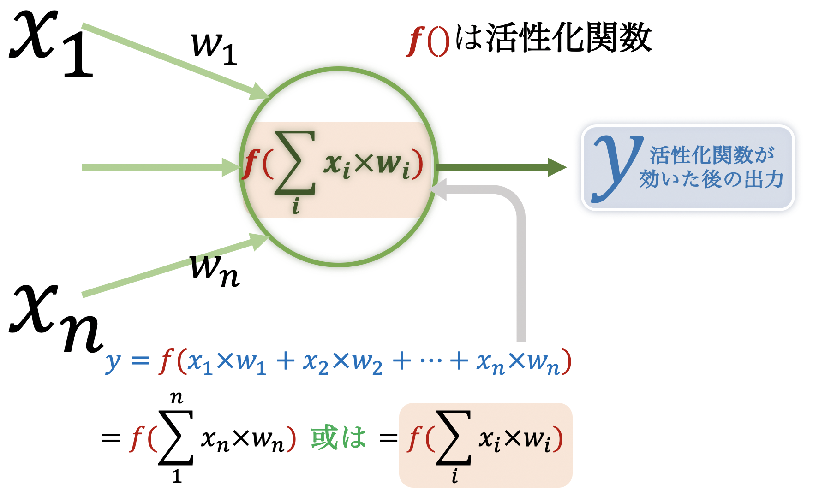
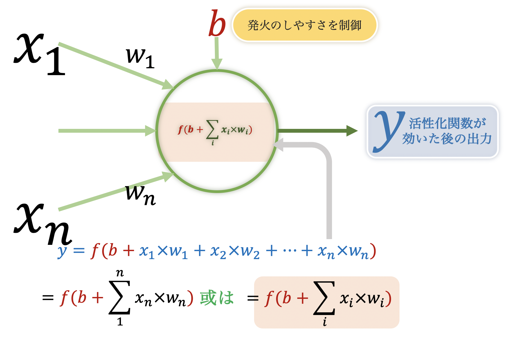
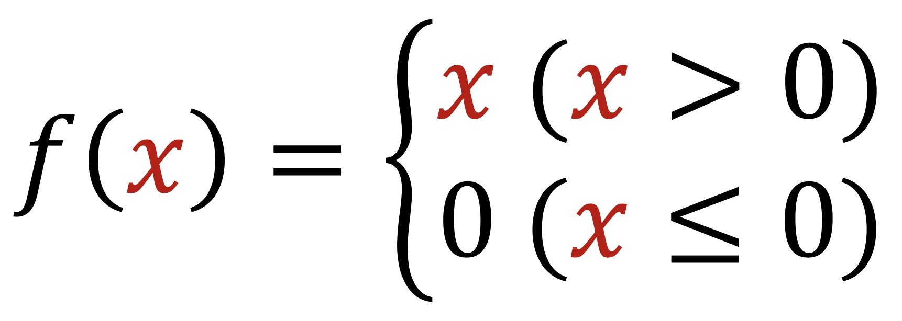
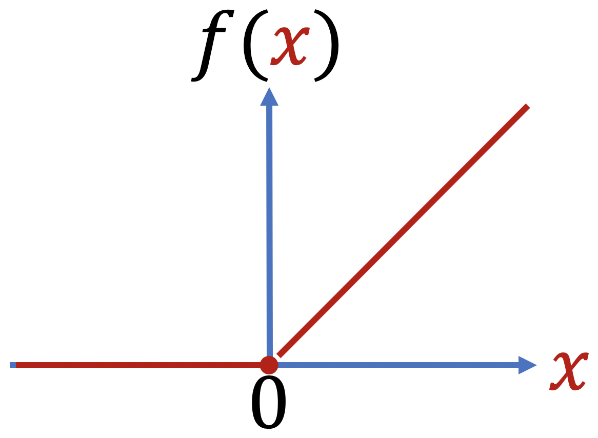
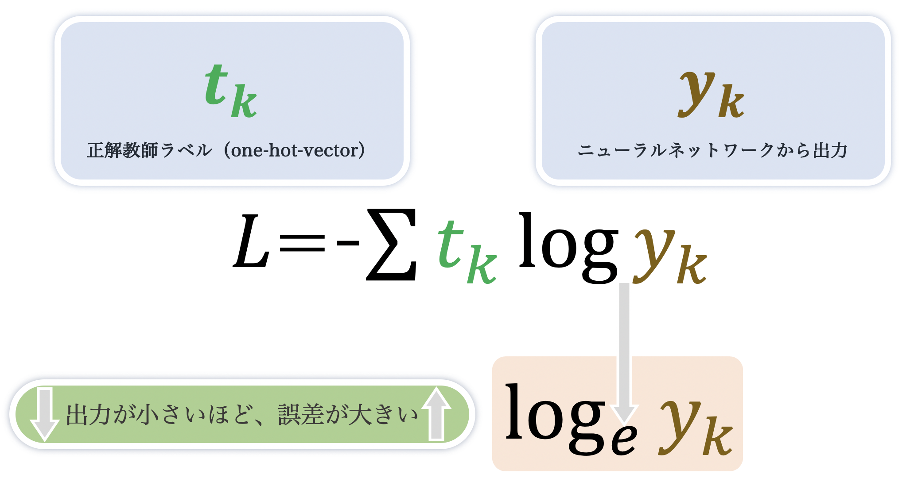

# 04 人工ニューラルネットワーク

## 生物ニューロンからパーセプトロン

[人工知能の歴史のところを参照](https://github.com/Kokensha/machine_learning_deep_learning_lessons/blob/master/01_ai_history.md)

### 生物ニューロン（脳神経細胞・シナプス）　→　生物ニューラルネットワーク（動物や人間の神経ネットワーク、脳）

### 人工ニューロン

### 形式ニューロン

### パーセプトロン 

* ローゼンブラット（RosenBlatt）がパーセプトロンを発表、パーセプトロンは形式ニューロンの実装

* 入力が一つの場合

* 入力が二つの場合

同じ原理で、入力は複数個になっても良い。実際に深層学習のニューラルネットワークでは、数百、数千の入力があるのも普通である。

* 入力が n個（或はi個） の場合

これを線形代数の行列の内積で、「表現」することができます。

* 活性化関数を適用した場合

パーセプトロンの中はまず入力とそれぞれの重み付けの掛け算の和を求め、その後活性化関数を適用する。多層ニューラルネットワークでは、層ごとに活性化関数を指定するのが一般的である。

* バイアスがある場合

この後も活性化関数を詳しく説明する。

パーセプトロンは人間の発明である。そしてパーセプトロンに期待通りの動作をしてもらうためには様々な工夫を施している。その中、活性化関数もその一つ。活性化関数を用いることで、パーセプトロン（或は人工ニューロン）にある特定の（人間にとって都合の良い）振る舞いをしてもらえるようになる。どんな活性化関数するには、それは研究者の様々な研究の結果によって、それぞれの特性を見て選択するものである。

### 単層パーセプトロン 

線形分離可能な問題に限られている。 -> 多層パーセプトロン

## 多層パーセプトロン（MLP:Multi-layer Perceptron）

* https://playground.tensorflow.org/ ここで確認しよう（活性化関数、学習係数、バッチサイズ、weight、biasなど）！

* 多層フィードフォーワード人工ニューラルネットワーク（feed forward neural network）ともいう

* 注意：フィードフォーワード人工ニューラルネットワークは、人工ニューラルネットワークのアーキテクチャの話で、層がループせず、次の層へ入力するになる子どである。MLPがそれの典型である。フィードフォーワード人工ニューラルネットワークと対照的なのは、RNNのような、順伝播ではないアーキテクチャである。

* フォーワードプロパーゲーション（forward propagation）の話と混同しないで

### 入力層（input layer）

* 入力層と隠れ層が完全結合

### 隠れ層（hidden layer）あるいは中間層

* 隠れ層が１つ以上存在する場合をディープ人口ニューラルネットワークと呼ばれることもある

* 隠れ層と出力層が完全結合

### 出力層（output layer）

## 人工ニューラルネットワーク

* 単層人工ニューラルネットワーク

* 多層人工ニューラルネットワーク

## 人工ニューラルネットワークの構造

### 線形変換

### 非線型変換

### 活性化関数（activation function）

* 活性化関数は一つの「**変換器**」にすぎない。〇〇の入力を△△にしたいときに、適切に「変換器」を選べる。

* どうして非線型である必要があるのか？

* 全てのニューロンに活性化関数を持っている

* 層（layer）ごとに活性化関数を固定するのが一般的

* 出力層の活性化関数は、回帰 -> 恒等関数、分類 -> ソフトマックス

* 活性化関数はReLUをよく使っている（下記参照）

#### 活性化関数種類

* シグモイド関数(sigmoid)

* ReLU（rectified linear unit -> rectified linear function:正規化線形関数）

## 人工ニューラルネットワークの学習（損失関数の話）

* 「学習」というのは、上の**重みパラメータに関する**損失関数（交差エントロピー誤差でも二乗和誤差でも）の値を最小になるためのパラメータ（ニューロンのweight）を見つけること。

* 損失関数を最小化 → 損失関数値を減らす方向を知りたい → 勾配が分かれば、傾きが分かる → パラメータを更新する方向が分かる → 勾配法 → 今はほとんど誤差逆伝播法（back propagation） 

* 解析的に解く → 解析解、数値的に解く → 数値解

### 損失関数（loss function）/目的関数、コスト関数（cost function）

* 人工ニューラルネットワークの学習で、微分可能な関数なんでも良い

* 決めるもの

#### 損失関数の種類

* 損失関数の場所は？　→　人工ニューラルネットワークの出力層の後（softmaxを挟むことが多い）

* 交差エントロピー誤差(cross entropy error)：回帰問題によく利用される

* 交差エントロピーはどこから来たか？ →　エントロピー　→　交差エントロピー

* 二乗和誤差(mean square error)：分類問題によく利用される

### ミニバッチ学習

上の交差エントロピーを例にして、データを一個ずつ学習するのが効率がよくない、例えばデータを100個ずつバッチにして、全体の近似として学習する

### 1 エポック（epoch） 学習

* 10000個のデータがあるとする、1ミニバッチに100個のデータがあるとする、学習回数は100回で、全てのデータを使い切ったことになる。100回の学習（時間）＝1エポック

### 勾配法

* 微分、偏微分、勾配、勾配法、勾配降下法、勾配上昇法

* 勾配降下法 (GD:Gradient Descent)がある、あとで詳説

* 勾配降下法の課題：谷での振動、プラトー（Plateau：高原）での停止、絶壁での反射

### 学習率（学習係数）

* learning rate 一回の学習で、どのぐらいパラメータを更新すべきか（更新量）を決める

### 誤差逆伝播法:back propagation（一般的に使われている）

* 損失関数の数値微分の計算は時間がかかる

* （微分するより）損失関数の勾配を計算する良い方法

* 誤差逆伝播法と順伝播（forward propagation)との関係：

順伝播は出力層から層を辿って活性化関数など計算していき、損失関数までの結果を出す。誤差逆伝播は、連鎖律で、損失関数の結果を用いて、順伝播と逆の方向で、勾配を効率よく計算（**更新も**）する。方向が違うだけではなく、担当する作業も違う。
また、逆伝播は学習フェーズのみ、推論フェーズ（学習済モデルを使って応用する段階）では順伝播のみ。

####  微分の連鎖率（チェインルール）誤差逆伝播法で使う

* 合成関数に関する微分の法則

### 最適化 (optimization)

勾配の計算ができたら、次はそれぞれのパラメータを更新する作戦（学習率：どのぐらい更新すれば良いか）を考える。バックプロパゲーションは、計算手段で、最適化は**学習率**をどう戦略的に更新していくか。

* 勾配降下法（GD）

* 確率勾配降下法 (SDG:Stochastic Gradient Descent) ミニバッチをランダムに選択することで

* モーメンタム（momentum）振動を防ぐ

* ネステロフの加速勾配法（Nestrov's accelerated gradient method）

* AdaGrad

* RMSProp(ヒントンの講義)

* AdaDelta

* Adam

* 自然勾配法

#### 各フレームワークのOptimizer

* (Google)TensorFlow 2 : https://www.tensorflow.org/versions/r2.0/api_docs/python/tf/optimizers

* (Preffered Networks)Chainer : https://docs.chainer.org/en/stable/reference/optimizers.html

* (Facebook)PyTorch : https://pytorch.org/docs/stable/optim.html

* (Microsoft)CNTK : https://cntk.ai/pythondocs/cntk.learners.html
