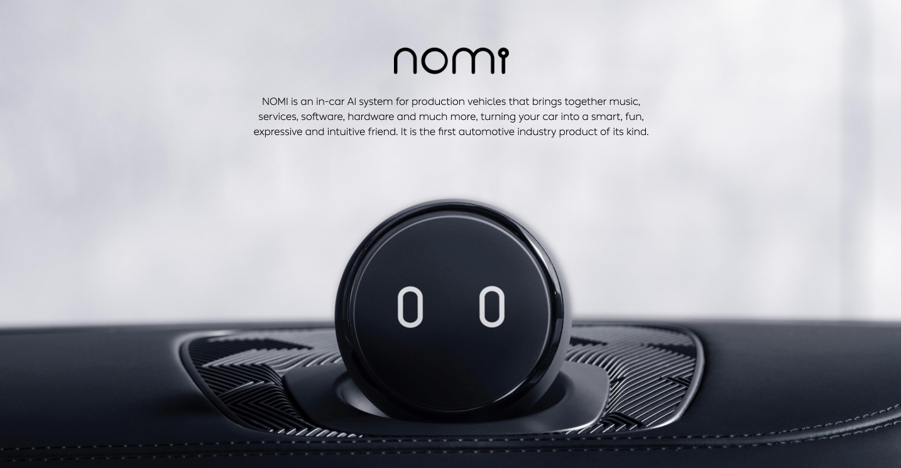

# 深層学習

## 深層学習のアルゴリズム

### CNN(Convolutional Nueral Network)畳み込みニューラルネットワーク

代表

* AlexNet

* VGGNet

* GoogleLeNet

* ResNet

* SENet

構成

* 入力層

* 畳み込み層

特徴マップfeature map

https://distill.pub/2017/feature-visualization/

* プーリング層

プーリングは圧縮

* 出力層

### RNN

### Auto-Encoder

### GAN（Ganerative Adversarial Network）

### 深層強化学習

## フレームワーク

* [TensorFlow](https://github.com/tensorflow/tensorflow) LISENCE： [Apache-2.0 and others](https://github.com/tensorflow/tensorflow/blob/master/LICENSE)

* [Keras](https://github.com/keras-team/keras) LISENCE： [MIT and others](https://github.com/keras-team/keras/blob/master/LICENSE)

* [PyTorch](https://github.com/pytorch/pytorch) LISENCE：[Facebook and others](https://github.com/pytorch/pytorch/blob/master/LICENSE)

* [Chainer](https://github.com/chainer/chainer) LISENCE：[MIT and Preferred Networks, Preferred Infrastructure](https://github.com/chainer/chainer/blob/master/LICENSE)

## 深層学習の応用

### 数値データ

#### 広告レコメンデーション

### 画像・映像データ

#### 手書き文字認識変換

#### 顔認識

#### 画像分類（りんごかミカンか、犬か猫か）

#### 医療診断（画像で、レントゲン画像で腫瘍や病変を見つける）

* 早期胃がん領域の高精度検出：https://www.ncc.go.jp/jp/information/pr_release/2018/0721/index.html

#### 物体認識（Object detection）

* YOLO

#### 自動運転（歩行者、標識、車道認識）

* Tesla

* Waymo

#### 人のポーズの検出

* https://github.com/tensorflow/tfjs-models/tree/master/posenet

### 言語音声データ

NPL(Natrual Language Processing):自然言語処理

* Googleの BERT

https://github.com/google-research/bert

* Baiduの　ERNIE

https://github.com/PaddlePaddle/LARK/tree/develop/ERNIE 

http://research.baidu.com/Blog/index-view?id=113

#### 音声認識

* Apple の siri

* Google の Google Assistant

* Amazon　の Alexa

* Microsoft の Cortana

* Teslaの音声コマンド

* NIOの音声コマンド

#### 音声合成Text-to-speech変換

音声認識とセットになっている場合が多い

* WaveNet:https://deepmind.com/blog/wavenet-generative-model-raw-audio/ 

#### 機械翻訳

* Google翻訳：https://translate.google.com

2016年9月GNMT/Google Neural Machine Translationを導入した（https://ai.googleblog.com/2016/09/a-neural-network-for-machine.html）

GNMTについての論文：https://arxiv.org/abs/1609.08144

論文のPDF：https://arxiv.org/pdf/1609.08144.pdf

#### 文章生成

* GPT-2:https://github.com/openai/gpt-2

#### 対話ボット

* FAQ対応、予約対応、コールセンター業務

### 生成

GAN（Ganerative Adversarial Network）

#### 画像、動画生成

* https://crypko.ai/#/

* 人の顔の合成：https://thispersondoesnotexist.com/

* deep fake:https://www.youtube.com/watch?v=cQ54GDm1eL0

