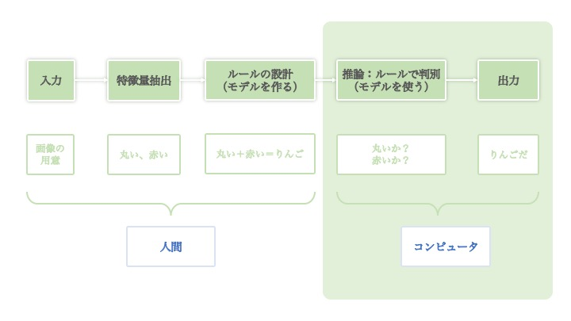
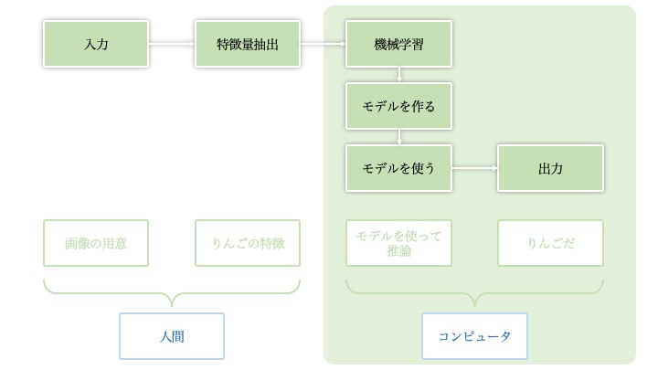
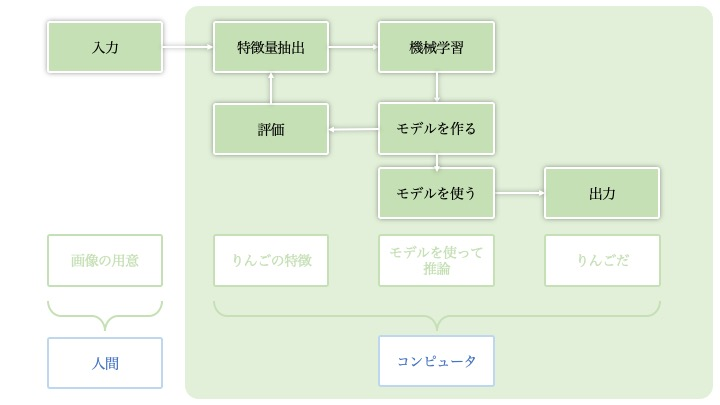
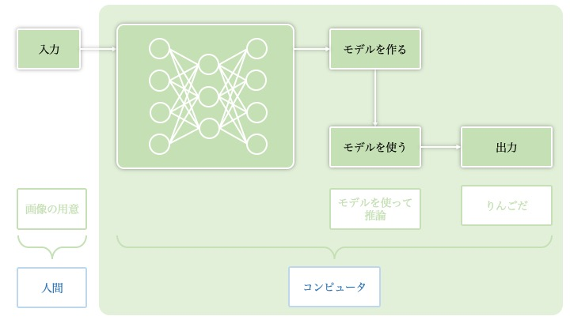
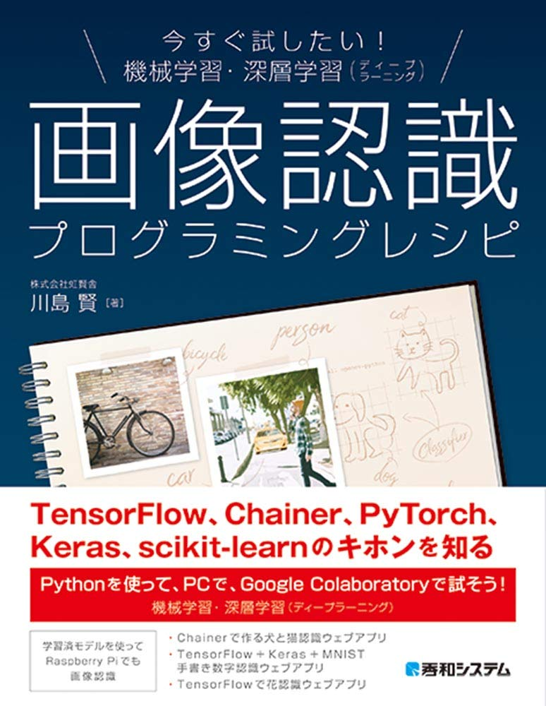
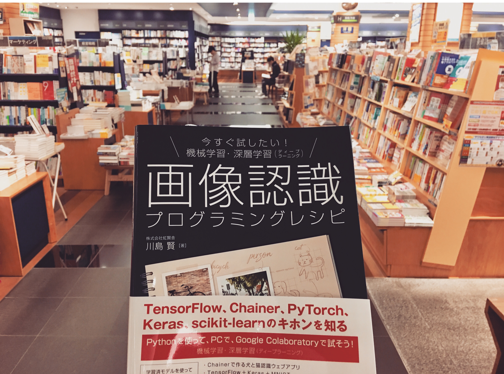

機械学習・深層学習レッスンの構成案

machine learning and deep learning lessons. 

初心者のための一番分かりやすい、効果的な日本語「機械学習・深層学習」教材作りを目指しています。

MITライセンスですが、商用の場合は事前にご連絡いただきますようお願い致ます。

# 目次

# [01 人工知能の歴史](01_ai_history.md)

## 人工知能、機械学習、人工ニューラルネットワーク、深層学習の関係

## 人間とコンピュータが担当するタスクの変遷

### ルールベースの時期

### 機械学習の時期

### ニューラルネットワークの時期

### 深層学習の時期

手法が変わることによって、人間が煩雑な作業から開放されつつあります。

もちろんですが、データの用意がまだ大変な作業として、残されています。

# [02 機械学習・深層学習の基礎](02_basics.md)

# [03 機械学習](03_machine_learning.md)

# [04 人工ニューラルネットワーク](04_artificial_neural_network.md)

# [05 深層学習](05_deep_learning.md)

# 06 畳み込みニューラルネットワーク（CNN）

# 07 リカレントニューラルネットワーク（RNN）

# 08 敵対的生成ネットワーク(GAN)

# 09 転移学習(Transfer Learning)

# [機械学習と深層学習勉強のリソース](https://gist.github.com/kawashimaken/7b7daf57a503bf73d94d0f7fe6bced9b)

# [ハンズオン](handson/README.md)

  - [ハンズオン内容の全体構成](handson/handson_plan.md)
  - [ハンズオンお読みください。](handson/common_rules.md)
  - [ハンズオン01：　機械学習scikit-learnアヤメ分類](handson/handson01.md)
  - [ハンズオン02：　機械学習scikit-learn手書き数字認識](handson/handson02.md)
  - [ハンズオン03：　ニューラルネットワーク及びニューラルネットワークの学習](handson/handson03.md)
  - [ハンズオン04：　ニューラルネットワーク 手書き数字認識　MINIST + Chainer](handson/handson04.md)
  - [ハンズオン05：　CNNの詳説（畳み込みニューラルネットワークの学習）](handson/handson05.md)
  - [ハンズオン06：　PyTorch+MNIST & PyTorch+ CIFAR-10](handson/handson06.md)
  - [ハンズオン07：TensorFlowとKeras、CNN 手書き数字認識　MNIST + TensorFlow + Keras、CNN Fashion認識　FashionMNIST + TensorFlow + Keras](handson/handson07.md)
  - ハンズオン08：転移学習 花ウェブアプリ　TensorFlow + Kera
  - ハンズオン09：転移学習 ペットボトルと空き缶の分類　TensorFlow + Keras（1）
  - ハンズオン10：転移学習 ペットボトルと空き缶の分類　TensorFlow + Keras（2）
  - ハンズオン11：GAN 手書き数字の生成
  - ハンズオン12：人工知能 Cloud APIの利用（Azure, Google, AWS）

Made with love by [https://kokensha.xyz](https://kokensha.xyz)

# 私の著書

「今すぐ試したい！機械学習・深層学習（ディープラーニング）画像認識プログラミングレシピ」のソースコードを配布するレポジトリです。

アマゾンのリンクはこちらです：https://www.amazon.co.jp/dp/4798056839

# 書籍のGitHub Repo

https://github.com/Kokensha/book-ml

# 川島のITスキルサロンのRepo

https://github.com/kawashimaken/salon

Pythonプログラミング（他のプログラミング全般）や、深層学習に関する指導をご希望の方は、川島のITスキルサロンの入会をご検討ください。https://note.com/kawashimaken/m/me13f2d6e0ab8

