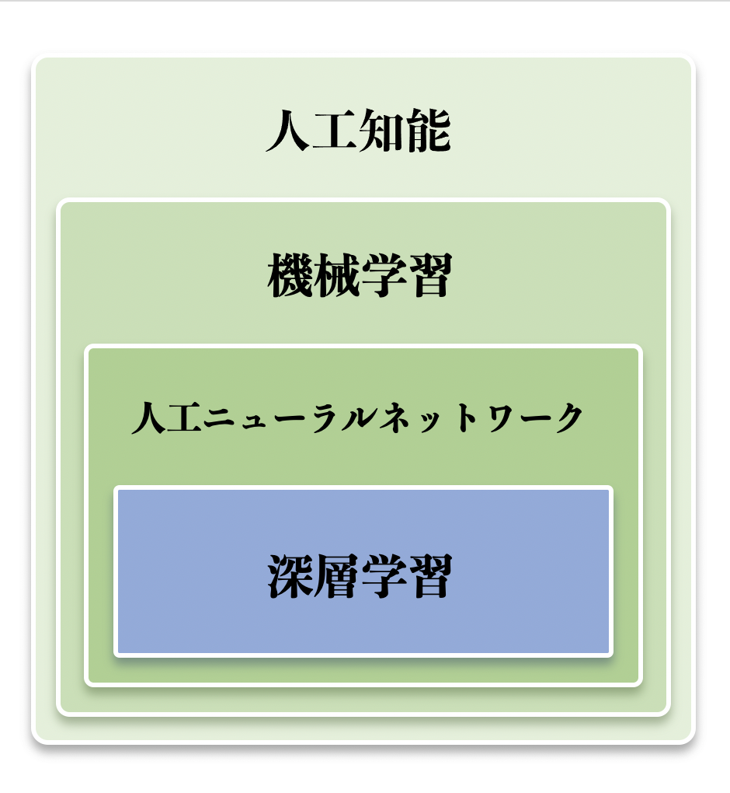

機械学習・深層学習レッスンの構成案

# 目次

# [01 人工知能の歴史](ai_history.md)

# [02 機械学習・深層学習の基礎](basics.md)

# [03 機械学習](machine_learning.md)

# [04 人工ニューラルネットワーク](artificial_neural_network.md)

# [05 深層学習](deep_learning.md)

Made with love by [https://kokensha.xyz](https://kokensha.xyz)
