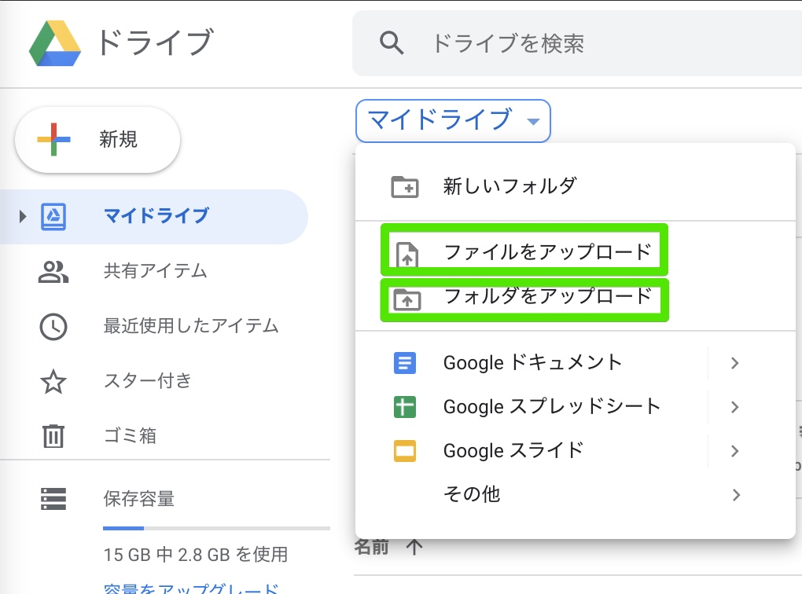

# [川島の自己紹介](kawashimaken_introduction.md)

# ハンズオン
* 参考書籍 「今すぐ試したい！機械学習・深層学習（ディープラーニング）画像認識プログラミングレシピ」強制ではありませんが、こちらの本をお持ちですとスムーズかもしれません。
* https://github.com/Kokensha/book-ml

# Colaboratoryの使用準備と使い方の説明 (10分)

* Google Colaboratoryの有効化（有効化していない人のみ） (2分)
* Google Colaboratory Notebookの作成 (2分)
* Pythonのバージョンの設定、確認、HelloWorld (2分)
```Python
print "Hello world!"
```
* Google Colaboratory Notebookへのファイルアップロード (2分)
```Python
from google.colab import files
uploaded = files.upload()
```
* Google Colaboratory Notebookでのパッケージのインストール (2分)

  - 例
  ```Python
  !pip install -U tensorflow
  !pip install -U scikit-learn
  ```
 
# 書籍のJupyter NotebookファイルをGoogle Colaboratoryにインポートする

* 04-03(scikit-learn iris).ipynb  : https://github.com/Kokensha/book-ml/blob/master/Colaboratory/04_03(scikit_learn_iris).ipynb


# 「あやめの分類」にチャレンジしよう (40分)

Pythonプログラムの解説もします。
* 参考: https://github.com/Kokensha/book-ml/blob/master/Colaboratory/04_03(scikit_learn_iris).ipynb

## 機械学習向けフレームワークscikit-learnの紹介 (5分)
  - scikit-learn URL https://scikit-learn.org/stable/
  - scikit-learn　バージョンの確認
  ```Python
  import sklearn
  print(sklearn.__version__)
  ```
## 機械学習のはじめの第一歩「あやめの分類」の概要 (2分)
  
  - アヤメの花　https://ja.wikipedia.org/wiki/%E3%82%A2%E3%83%A4%E3%83%A1
  

## アヤメデータの説明(データに慣れる) (10分) 
データに慣れることがとても重要！
データの構造、意味が分からないと、良い結果に繋がる処理ができない

* Andersonが採取、整理し、Fisherが1936年論文で使用

* データセットの中身
  - Sepal Length（がく片の長さ）
  - Sepal Width（がく片の幅）
  - Petal Length（花びらの長さ）
  - Petal Width（花びらの幅）
  - 種類
    - setosa, versicolor, virginica
  
* アヤメデータの用意
```Python
iris = datasets.load_iris()
```

* 表形式でデータを見る
* データ全件をみる
* 一つの特徴量を見てみる
* データの可視化
  - 1列目、2列目のデータを使う場合
  - 3列目、4列目のデータを使う場合
  - 3Dグラフ（次元削減）

## １回目の学習プロセス
１回目は、グラフを描きながら、解説を丁寧に行う
*　分類と回帰 (2分)
  - 分類の例
  - 回帰の例

* サポートベクターマシンの紹介と理論の解説 (2分)
  - SVMは重要は分類と回帰のアルゴリズムである
  - 超平面を求める手法である
  - 回帰係数と誤差（グラフで、クラスの間の境界線）

* 超平面（Hyper-plane） (2分)

* 交差検証 (5分)
  - 交差検証とは
    - 学習データ（train_data）と検証データ(test_data)を分ける
    - 検証データは、学習に使わない
  - Mlxtend (machine learning extensions)  http://rasbt.github.io/mlxtend/
  
* 分類（predict）

## ２回目の学習プロセス(5分)
２回目は、グラフなし、コンパクトなプログラム
* 学習と検証
* 分類（predict）

## 実際に「あやめの分類」をやってみよう  (2分)

## 参考リンク
* https://scikit-learn.org/stable/auto_examples/datasets/plot_iris_dataset.html
* アヤメデータセットについて（Fisher's アヤメデータセット、Anderson's アヤメデータセット）：https://en.wikipedia.org/wiki/Iris_flower_data_set


# 今後(5分)

* 今後は「じっくりハンズオンクラス」と「ビジネスオリエントクラス」開講も検討しています。「じっくりハンズオンクラス」は、初心者向けでゆっくりしっかり基礎から、大量のレシピをクリアしていくことで、機械学習と深層学習の重要基本をしっかり身に着けるコースです。「ビジネスオリエントクラス」は機械学習、深層学習の実際の業務をイメージして、特訓する中級学習コースとなります。（内容変更、調整することがあります。）

# 質疑応用（0-30分）

# アンケート回収

# スタッフ片付け、解散
