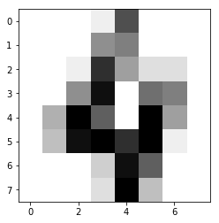
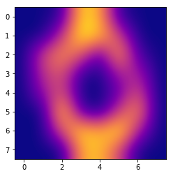
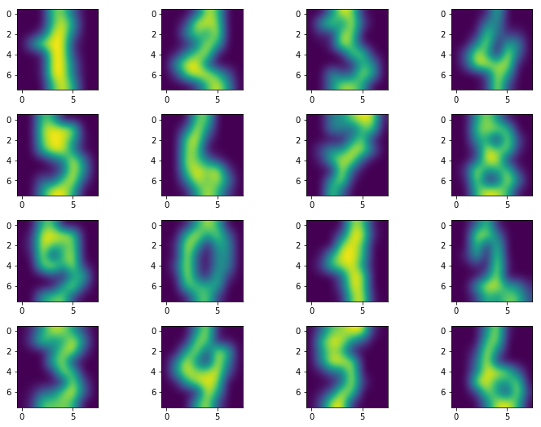

# 第2回　ハンズオン

前回第1回は[こちら](handson01.md)です。

* 「今すぐ試したい！機械学習・深層学習（ディープラーニング）画像認識プログラミングレシピ」強制ではありませんが、こちらの本をお持ちですとスムーズかもしれません。

* 上記書籍の225ページ〜241ページまでご参考するか、または下記の記事を合わせてお読みください：https://kokensha.xyz/ml/machine-learning-tutorial-scikit-learn-digits/

https://github.com/Kokensha/book-ml

# 手書き数字認識

## 特徴量を調べる

* データを表示する

* データを画像として描画する
 
  - 
  - 
  - 

* 手書き数字データセットを三次元空間で見る
 
  - 

* 分類器をインポートする

* 分類器（SVC）の作成

* 検証

